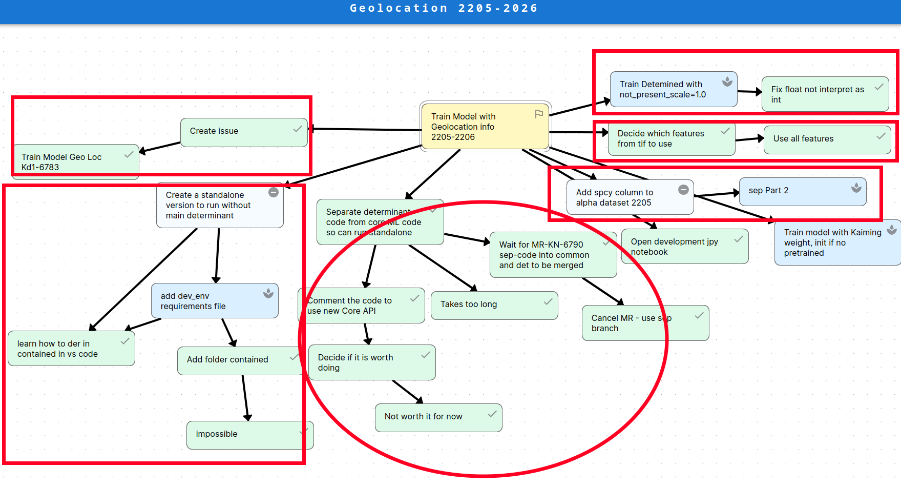

# **Deliverable 2**

# Winning Pitch

The winning pitch is the Questline feature!

The updated details of the pitch can be found [here](../pitches/questline).

# Updates to Winning Pitch

- UI Overlay will be moved to top left instead of it living in the bottom left.
- Quest View will be scrapped as it's not needed, as the user only needs to know the current task and next task (which is covered in the quest toolbar).
- Instead of grouping quests by children relation, we group tasks into a questline by using the "parent" node as the root and any children can be shared between quests.
- Instead of searching for new tasks to work on via "depth-first" search, we will use node typings to find any "ready" node in the current quest.
- Subgraphs are treated as one node when calculating percentages to avoid having to load all the subgraphs again

# Discussion

## [Questline](https://github.com/Daanish-Khan/seg4105_project/tree/main/pitches/questline)

- Questline is a solution to user "choice exhaustion" in larger graphs. Alot of "ready" tasks in a graph can overwhelm the user when they try and pick a task to work on, especially when other tasks rely on completion.
	- The software will pick for you, and provide a gamification of the system in the form of quests. Each quest will be a separate branch of the graph, allowing the user to systematically work up towards the goal without having to decide what to work on.

### Does the problem matter? 

- Large graphs in the Mikado Method can lead to clutter and be disorganized. Without some sort of guided task tracker for the user, the UI will become overwhelming and give the user "choice exhaustion"
	- It was brought up to the client and he liked the idea, as he had dealt with large graphs before (on paper)

- Multiple customers will use the feature as each graph will eventually grow in size as a project progresses or new requirements are added. We will advertise this feature in the software, and since we aim to make it intuitive as possible, we believe that most people will use this feature
	- Except when working on small graphs, then the feature is not needed.
		- People will not use it initially, but will eventually see the need for it.

- Conclusion: The problem does matter to most customers.

### Is the appetite right?

- Depending on some features for the questline system, 6 weeks may not be feasible. We needed to ask ourselves a couple questions regarding the questline system.

- Should the questline look into subgraphs?
	- Looking into subgraphs would require alot of database changes. It would also significantly slow down performance, as there is a possibility of the quest being infinitely large due to subgraphs not having a depth limit. It would also be too cluttered to defeat the purpose of quests if the quest itself is very large.

- An explanation of the questline system was asked for. Daanish provided a drawing shown below, with each circle being designated as a quest. The goal node is special, and every branch not related to each other is a questline.

- It was mentioned that implementation might be difficult if we have to detect which trees are separate. A new algorithm would have to be developed and that would take a significant amount of time.
	- An alternative solution was suggested, where each primary node coming off of the goal node is considered the "parent" to a questline. Any children related to separate questlines are shared and are processed separately based on which quest is chosen.
		- This solution was chosen as it would be simpler to implement and we already have some of the business implemented.

- How do we order tasks?
	- The initial suggestion was to use a "depth-first" approach, where the lowest ready task in the branch would be used first
		- However, that would include searching, an expensive task and would not be responsive on large graphs

	- Alternate solution was proposed: since we have node types (ready, completed, blocked), we only need to sort by ready tasks. This saves us time and effort in both implementation and runtime.

- What UI are we implementing?
	- A overlay and a toolbar/modal to display the current task and the toolbar to switch quests.
	- Synchronization issues were brought up where the graph can change if a new task is added
		- Solution: use the graph as the source of truth and rerender on any changes.

- Are we going to draw the questline/display it?
	- No, we are just going to display the current task on the graph itself.

- Concludes that from the discussion above, we have decided the appetite is right with the constraints and solutions we applied.

### Is the solution attractive?

- The real estate used would just be an overlay on the bottom right side of the screen so the user could determine what to work on at-a-glance.
	- It was brought up that the overlay would conflict with the "add node FAB" on mobile.
		- Solution: Move it to the top left.

- Since its a small space & questlines are an essential part of our system, the space used will be kept for the future.

- Concludes that the solution is attractive.

### Is this the right time?

- We are still in development, and no major features are currently being implemented, only just polishing previous ones (splash of news with a new feature)
	- We aim to deliver this feature at the end of the 6 week cycle

- Concludes that this is the right time for the task.

### Are the right people available?

- We have multiple people that do not have work at the moment, as we all have just been polishing UI/UX. We have individuals who can work on fullstack, as well as the concrete UI design of the feature.

- We have the expertise, midterms are almost over, and everyone has been doing small batch and want to do a big batched feature.

- Concludes that the right people are available.

## [Scanning](https://github.com/Daanish-Khan/seg4105_project/tree/main/pitches/scanning)

This feature allows users to scan Mikado Graphs on paper and import them into our software using image & text recognition.

### Does the problem matter?

- Important for our client to convert all his paper graphs to our software.
	- His graphs are huge, therefore would be tedious to import manually.

- However, if it doesn't work, it might cause alot of customer support headaches.
	- Nodes not properly importing/text not readable/edges not correctly connecting, etc

- It doesn't matter to those who are just starting out with the Mikado Method, as they won't have any paper graphs to import.
	- Just scanning isn't the whole process, you'd also need to move some nodes around to organize, so some manual intervention is required anyways

- Conclusion: The problem doesn't really matter for the client, as he can just import it manually, even if it'll take some time. New users wont even use this feature if they are new to the Mikado Method, which is likely as this methodology is niche.

### Is the appetite right?

- Image detection is really finicky to get right
	- One member's co-op term dealt with OCR, and it took quite a while to get to a barely working prototype.
	- Need to take into account different cameras, camera glare, image quality, handwriting quality, etc
		- Too many factors to take into account that will eat up alot of development time

- Can have a default setting and have the user tweak, but that needs a comprehensive UI to be implemented for customization

- Would this improve new user experience?
	- Like previously discussed, new users won't be familiar with the Mikado Method and people who want to import would use the feature only once.
		- Target users would be people who 1. use the mikado method and 2. draw the graphs on paper.
			- Unlikely as those who are familiar with the method would just use some other electronic platform to manually draw their graphs

- Could we do this in 2 weeks?
	- No, as OCR is too much of a risk and too finicky to get right.

- Conclusion: Appetite is too big and there are way too many rabbit holes to get a proper implementation. Can be circumvented entirely by just recreating the graph manually

### Is the solution attractive?

- We can afford adding a camera button to the home page for importing, as there is alot of space free. We can also hide it in the user profile hamburger menu.

- Comparison of importing manually and automatically
	- Admittedly, recreating large graphs manually will take alot of time. However, we provide tools to make the process easier (e.g. double click to quick add nodes, dragging two nodes together to connect them)
		- Working on this feature would marginally reduce the time it takes to import due to potential bugs arising in the OCR process

- Solution is **not** attractive.

### Is it the right time?

- This is a new major feature, and we don't have anymore polishing to do. 
	- Therefore, it would be the right time to implement this feature.

### Are the right people available?

- One of the team members has experience with OCR and image recognition.
	- Member said that it took a long time to get a prototype and it was a while ago, so their skills may have degraded over time

- Fixing unexpected issues might cause alot of scope creep due to unfamiliarity of software tools needed to implement the feature

- Although we have the developers available, they do not have the expertise to be able to efficiently implement this feature.

- We are not certain if we have the right people available for this task.

