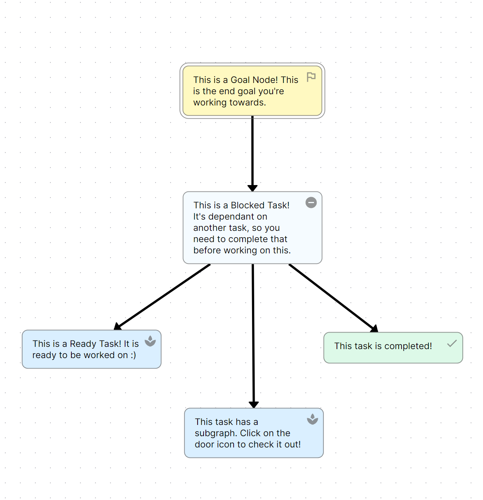
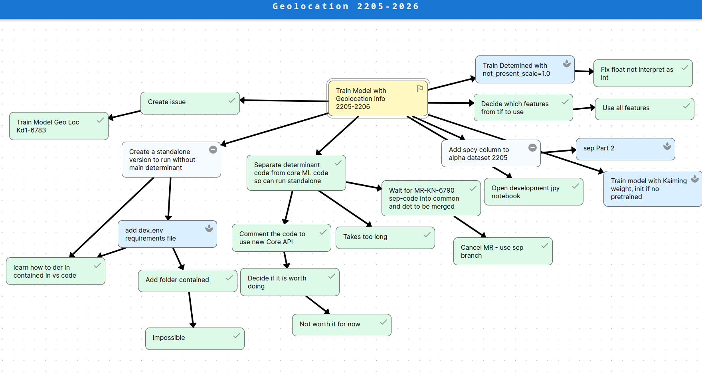
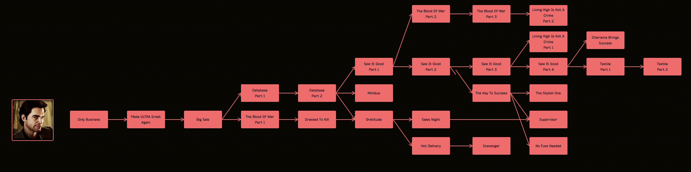
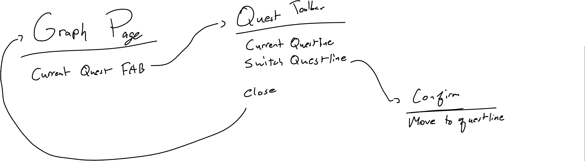
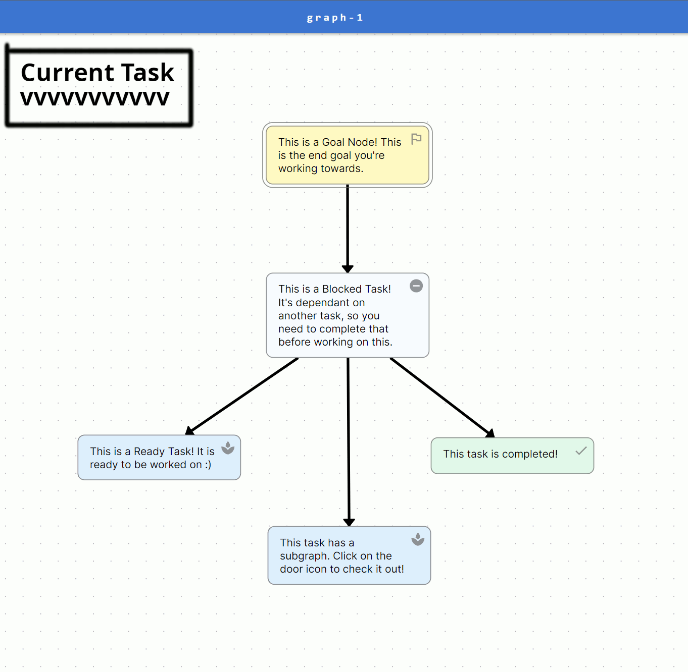
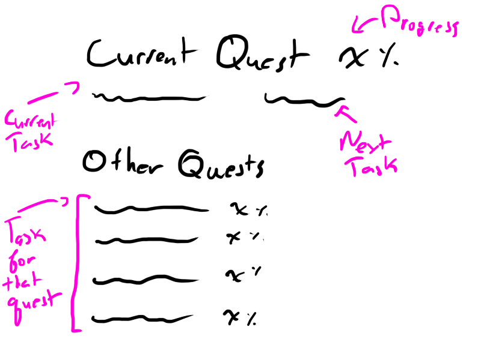

# Questline System

### Daanish Khan | 300126840

## The problem

The Mikado Machine (https://mikadomachine.uottawaesports.ca) is an intuitive and easy way to organize and display a workflow, especially when tasks are dependant on each other. A simple graph can be seen here:

As seen above, a node is easy to identify and a user can distinctly identify nodes that need to be worked on. However, this is only easy for small graphs like the one above. With larger graphs, keeping track of what's what gets a little more complicated.

While the user *can* quickly identify nodes that can currently be worked on, it's hard to determine what to work on *now*. This can overwhelm the user, and we want to reduce clutter while also guiding the user to efficiently complete tasks.

There really is no current implemented solution to this problem, other than keeping an external list of "Ready" tasks to work on. We want to integrate this system into our software without the user needing to rely on external products. 

We need to create a solution that is also implementable in 6 weeks - which is our timeframe we are allotting to this project.

## The Solution - Questlines!

This solution takes alot of inspiration from video games - particularly RPG's. Most of these games gives the player some sort of progression in the form of tasks, allowing for the user to progress through the story. If you map out a questline from a game like Escape From Tarkov, you can see how similar it is to a Mikado Graph:

We want to implement the same sort of functionality in our software. Questlines are an easy way to keep track of your progress and game-ify tasks, allowing for user satisfaction and more importantly reducing the overwhelming aspect of choosing what to work on.

Our solution is two parts: the Quest Toolbar and the Current Task View. The Quest Toolbar is used to view the current questline and view progress, and the quest view will allow for the user to view all tasks in the line. The Current Task View would be an indicator of the current task to work on, so the user can quickly get to work without having to decide for themsevles. This would be on top of the current graph, and clicking on this would show the Quest Toolbar:

### Current Task View

This view is simple and is the entrypoint into the flow, as well as providing some sort of quick indicator of what task to work on. This picture provided below isn't specific, but aims to visualize what it could look like on the screen:

### Quest Toolbar

This toolbar would be accessible to the user upon them interacting with the current task view in the graph UI. Once accessed, the user could see the current quest as well as progress - allowing them to quickly assess how much they have completed. They would also have the ability to switch quests, giving the user some control over what they want to work on. Again, although there is some choice available to the user, we are providing a guided workflow. 

### Quest View

This view was originally to provide a more detailed view for the current quest, providing all tasks in the questline. This view is different than the quest toolbar as a user may want to browse through the quest to see whats coming up next.

[Old quest view drawing](./questview.png)

#### Quest View Rabbit Hole

One option I explored was to highlight every node in a quest when a quest was selected. This would get rid of quest view entirely. However, the implementation would be difficult, and would take alot of refactoring of the current codebase to implement properly. It would also conflict with another feature of our software - Subgraphs. In short, subgraphs are a secondary graph linked to a node in order to reduce clutter by separating large dependency trees into its own graph that is still linked to a node. If we were to highlight nodes in the UI, how would we properly show subgraphs along with the parent nodes? The solution would take too much time to develop, and implementation isn't feasible. A list of tasks is more than enough to convey what we want while also being clear to the user.

Then we realized that the quest view itself was a rabbit hole. Just the current task view and the quest toolbar are enough for users to enjoy this feature. Adding another screen is redundant and may lead to more and more duplicate views of the same data being added. Therefore, we will mark quest view as a no-go. We will also mark entering/expanding/analyzing the insides of subgraphs from this feature as a no-go and just treat them as entire nodes for the percentage calculation.
