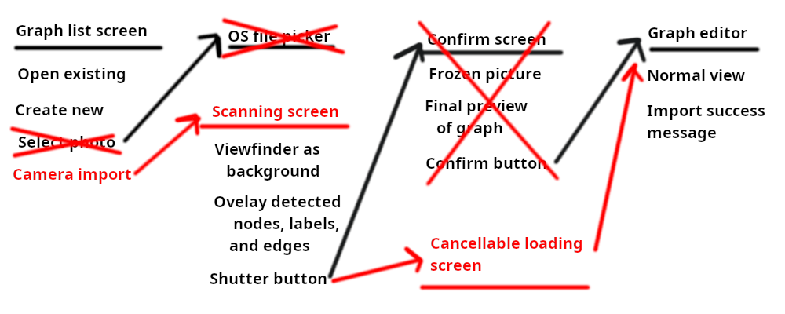
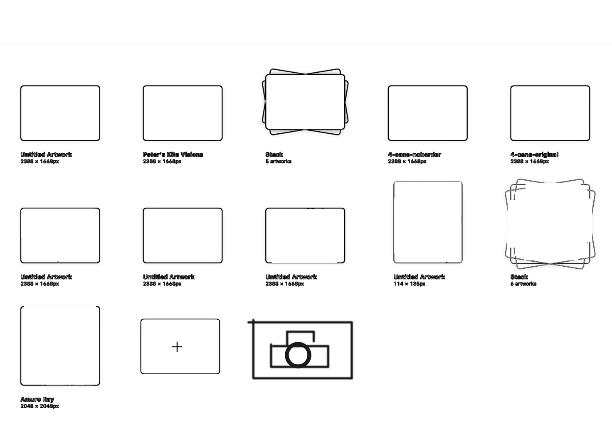
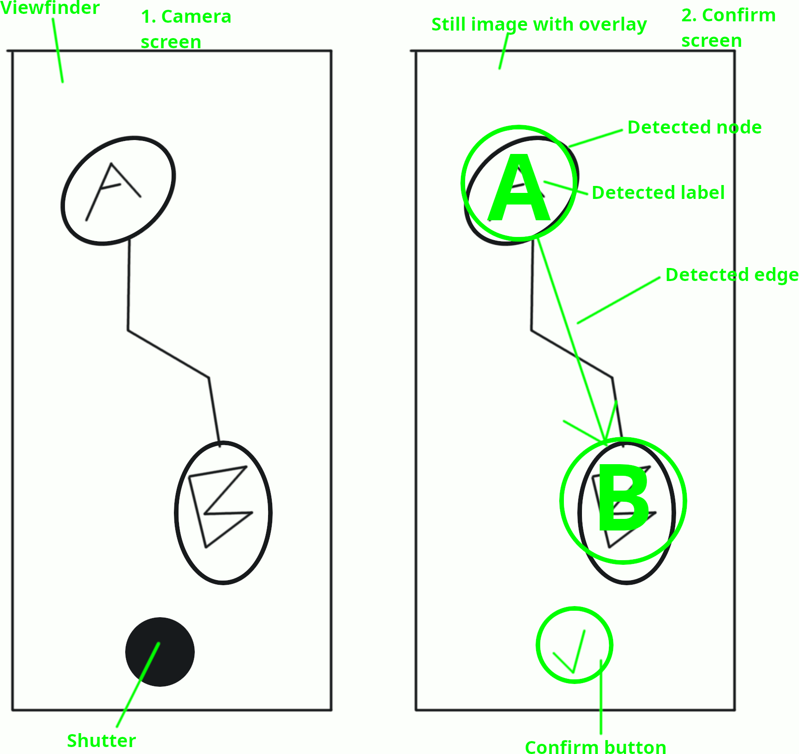

# SEG4105-A02 Deliverable 1

|Name|Student Number|
|---|---|
|Daniel Tang|0300068985|

## Problem

As a client, I would like to quickly import my existing paper drawings so that I can start using the app easier.

The feature is titled “Paper Mikado scanner.”
Our client has a lot of hand-drawn Mikados graphs on paper and appreciated it when I manually digitized him one into our Mikado method webapp.
Other people may have similar graphs or flowcharts we can try to import.
This will reduce friction to onboard more users.
This customer is a good fit for the product because he is our main customer.
The baseline is the current manual digitization method, measured by the amount of the customer's and our time spent and the number of complaints, both of which should be decreased.

## Appetite

Our appetite is the 6-week cycle for deliverable 3.
In that time, the development of this feature must not take up time we want for other classes, especially around midterms and exams.
I also do not have even a 0 day appetite for researching or debugging vision algorithms, needing to focus my studying effort on other courses.
I am willing to spend a maximum of 6 hours per week on this feature, aiming for 3 hours.
We will stop after getting the client's provided drawings to import when scanned on a clean background without any tilt, and leave this only a nice-to-have feature for other customers for this sprint.

## Solution

To do this, we can use text and shape recognition AI fed from the phone’s camera.
Those will be combined to find the types of nodes, edges, labels, and completion statuses that best-effort approximate the user’s intent.
For example, a circle around text creates a node, a line with its ends close to two circles creates a connection downwards, and a checkmark near a circle sets the node to complete.
The goal is speed/convenience not accuracy.
The user should be impressed by the ease-of-use and any messy handwriting is expected to be fixable later.
We will integrate off-the-shelf vision libraries, without even any finetuning.

### Breadboarding

This scanning feature adds a new flow between the entrypoints of creating a blank or opening an existing graph in the welcome screen and editing the graph in the normal editor.

### Embedded sketch

We would like to add a new camera button to the welcome screen (which should be implemented by the team by the time we select a pitch).
Then it goes through a flow of two new screen before going to the regular graph editing screen.
The button drawn with the marker visualizes what is added by the new feature.

## Fat marker sketch

The user is shown a screen to take a picture.
The overlays and preview will only appear after the user takes the picture to avoid extra work debugging momentary glitches or performance problems.
The user is asked to confirm (or use the OS back button/gesture to retry) to prevent them from having too many graphs of unwanted previous scans.

## Rabbit Holes

One rabbit hole is customizing the vision algorithm and not leaving it as the off-the-shelf defaults.
That would have lead to an investigation of one setting after another, then a research of complicated concepts.

Another rabbit hole is trying to tell the shapes apart from the labels.
An arrowhead or a line is hard to tell apart from a "V" or an "l."
To avoid having to solve this problem, we just set a minimum size for each, with the shapes bigger than the labels, and have the user discover this while experimenting.

The biggest rabbit hole is trying too hard to increase accuracy.
AI is fundamentally probabilistic, so the last 20% will take up 80% of the time if we don't decide early to ignore it.
Fixing tilt, removing backgrounds, understanding text better, and ignoring glare/dirt are all hard problems that are researched by companies specialized in computer vision, and we are not one of them.
It would also slow down the post-scanning processing and defeat the purpose of delighting the client with the speed.

## No Gos

We will not support internationalization i.e. scanning labels for non-English text.
Internationalization would involve language detection and cut into the accuracy of the cases for our client wants to scan English text only.

We will not allow importing pictures from the user's gallery either.
We want the user to know that they should retry the scanning if the result is not satisfactory.
If they could retry a single image multiple times, they might get frustrated and start eating up support time.
