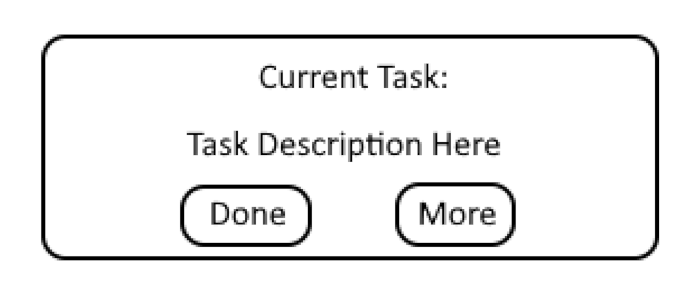
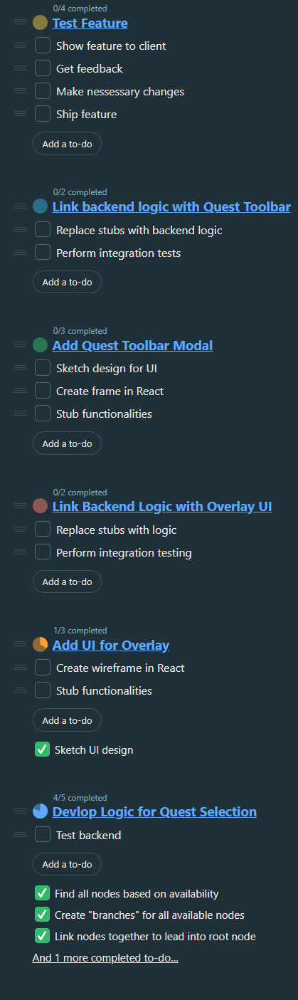
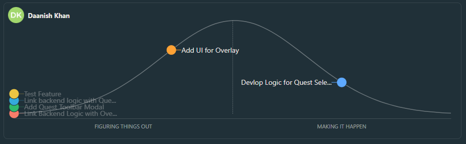

## Stand up Notes
Started @ 10:00 am, ended @ 10:20 am
In attendance: Daniel, Daanish

### Agenda:
- Discuss progress with questline feature
- Discuss blockers
- Update hill chart/to-do list

### Conclusions
- Discuss progress
	- Algorithm for node assignment has been completed
	- Quest "parents" searching has been completed
	- **Backend has been completed**, all methods have been implemented, testing needs to be done
		- Task added to to do list since it was not in there before
	- Base UI for overlay have been built
		- No functionality
	

- Blockers:
	- None at the moment

## To-Do List

## Hill Chart
