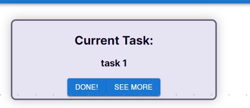
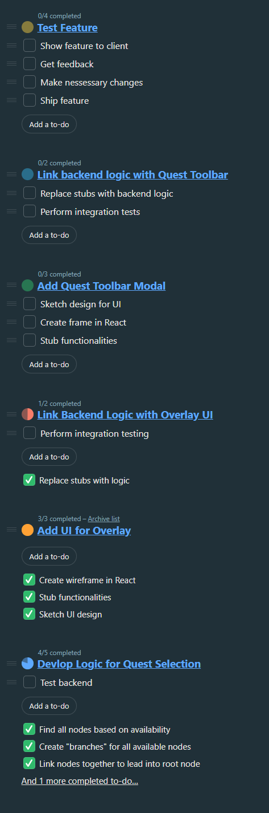
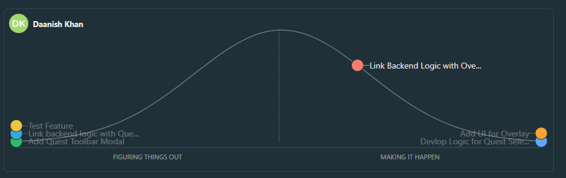

## Stand up Notes
Started @ 10:00 am, ended @ 10:45 am
In attendance: Daniel, Daanish

### Agenda:
- Discuss progress with questline feature
- Discuss blockers
- Update hill chart/to-do list

### Conclusions
- Discuss progress
	- Backend has been tested completely and is functional
	- The backend algorithm was very inefficient, Daniel and Daanish spent most of meeting discussing how to make it better
	- Decided on a couple of factors, including using a mark-sweep algorithm
	- Questline Overlay UI
		- React component has been completed and stubbed
			- Functionality has been implemented in the same week
		- Need to do integration testing still

- Blockers:
	- Quest toolbar modal is blocked by completion of quest overlay, which will be done in the following week

||
|:--:|
| *Component with buttons and functionality* |

## To-Do List

## Hill Chart
