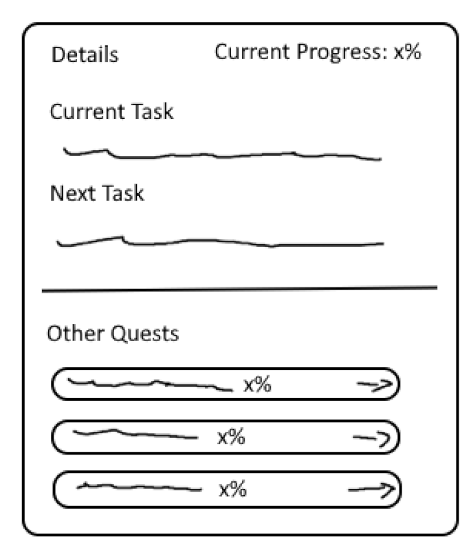
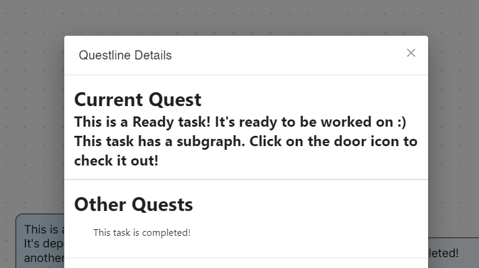
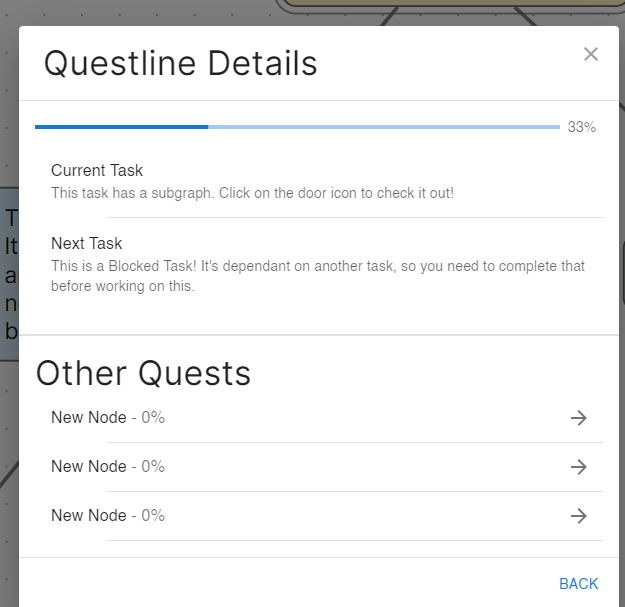
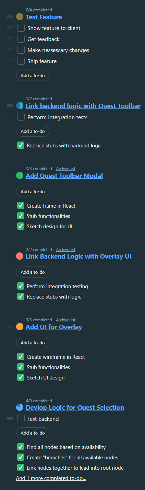
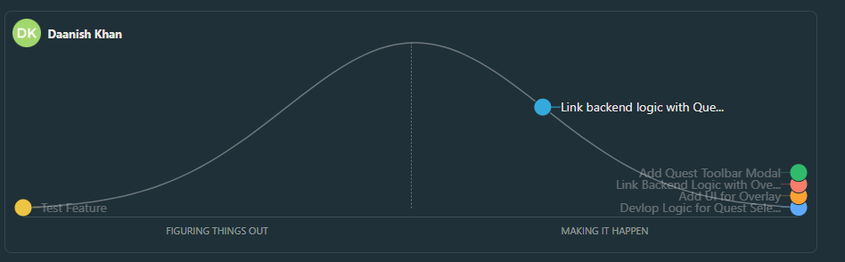

## Stand up Notes
Started @ 10:00 am, ended @ 10:20 am
In attendance: Daniel, Daanish

### Agenda:
- Discuss progress with questline feature
- Discuss blockers
- Update hill chart/to-do list

### Conclusions
- Discuss progress
	- Integration testing for overlay has been completed
	- Modal now changes based on current task
	- UI Changes
		- Removed the buttons as they were too cluttering, and functionality was duplicated in the "Done!" button
	- Quest Toolbar Modal
		- Design was sketched, and component was created in React
			- Functionality was stubbed and then implemented in past week
			- Need to do integration testing
	- Next steps
		- Integration testing, show feature to client and deliver

- Blockers:
	- None at the moment

||
|:--:|
| *Sketch of the Modal* |

||
|:--:|
| *Initial Wireframe + Stubbing (progress indicators not shown)* |

||
|:--:|
| *Completed Modal with Styling + Functionality* |

## To-Do List

## Hill Chart
