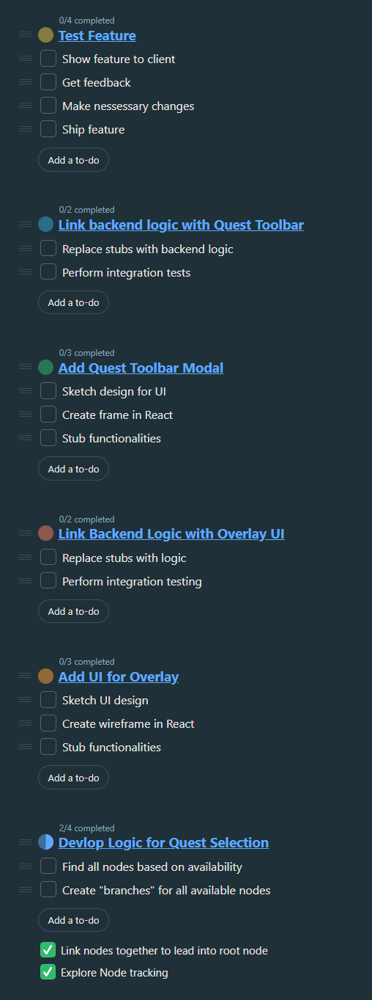
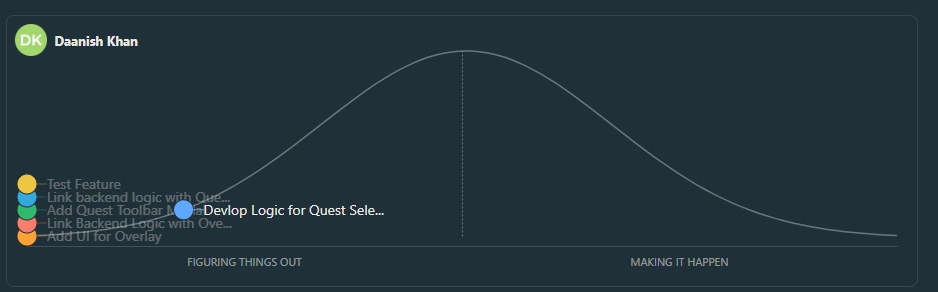

## Stand up Notes
Started @ 10:00 am, ended @ 10:15 am
In attendance: Daniel, Daanish

### Agenda:
- Discuss progress with questline feature
- Discuss blockers
- Update hill chart/to-do list

### Conclusions
- Discuss progress
	- Other issues mentioned in previous stand up have been resolved
	- Folder refactoring has been completed
	- Questline:
		- Daanish exploring node tracking, able to get all nodes that are ready
		- Linking nodes together has been completed

- Blockers:
	- Daanish struggling a little bit with traversal algorithm, will need more time to solve
	- Daniel blocked on Daanish as backend is needed first, will start designing UI components
	- Midterms killing both of us

## To-Do List

## Hill Chart
