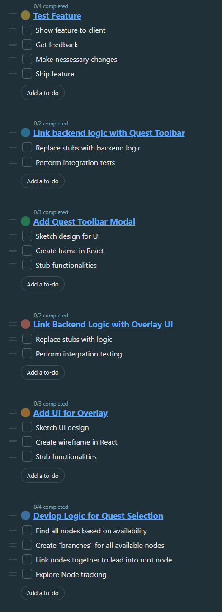
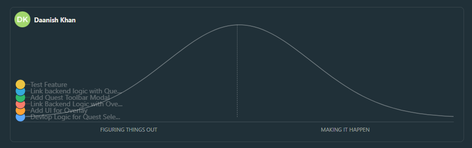

## Stand up Notes
Started @ 10:00 am, ended @ 10:40
In attendance: Daniel, Daanish

### Agenda:
- Kick off development of new feature
- Discuss issues that need to be fixed prior to development
- Break up work into tasks
- Assign tasks to individuals

### Conclusions
- Officially started questline development
	- Daanish will be working on backend + questline overlay
	- Daniel will be working on questline modal and logic
	- Tickets have been created
	- To-do and hill chart need to be created (will be included here after they are made)

- Issues that need to be fixed
	- Some high priority bugs that client requested to do need to be finished first
		- Will take some time to complete
	- Folders need refactoring as they are too cluttered

- Blockers
	- Midterm season going to hinder work progress
		- Expected low development for a week or two

## To-Do List

## Hill Chart
